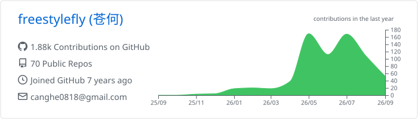

# Hi, I'm Canghe 👋

🚀 Founder of WeSight | 🤖 AI/Agent engineer | 🏆 Microsoft MVP

I have 10 years of internet industry experience and am now building WeSight as an AI entrepreneur. I am a top AI blogger in China, focused on AI going global, AI coding, intelligent agents, MCP, and Skills.

> ⚡ I am exploring how small teams can ship with agentic workflows: model reasoning, tool use, memory, automation, and human taste working in the same loop.

## 🧰 Skills

## 🌟 Open Source AI Projects

<!-- AI_PROJECTS:START -->
Public AI-related repositories, with both the gallery and full list ordered by GitHub stars. Metrics are generated from the GitHub API and refreshed automatically.

### ✨ Featured Gallery

<table>
<tr>
<td width="50%" valign="top">
  <a href="https://github.com/freestylefly/awesome-gpt-image-2"><strong>awesome-gpt-image-2</strong></a> 
  Prompt as Code for GPT-Image2, with reverse-engineered cases and production-ready prompt templates.  
  Stars: <strong>8,606</strong> · Forks: <strong>1,091</strong> · Updated: <strong>2026-07-22</strong>
</td>
<td width="50%" valign="top">
  <a href="https://github.com/freestylefly/CodexGuide"><strong>CodexGuide</strong></a> 
  An open-source Codex guide and knowledge base for Chinese developers.  
  Stars: <strong>2,808</strong> · Forks: <strong>274</strong> · Updated: <strong>2026-07-22</strong>
</td>
</tr>
<tr>
<td width="50%" valign="top">
  <a href="https://github.com/freestylefly/openclaw-wechat"><strong>openclaw-wechat</strong></a> 
  A bridge that helps OpenClaw-style agents connect to personal WeChat more reliably.  
  Stars: <strong>1,673</strong> · Forks: <strong>341</strong> · Updated: <strong>2026-02-13</strong>
</td>
<td width="50%" valign="top">
  <a href="https://github.com/freestylefly/director_ai"><strong>director_ai</strong></a> 
  AI comic and video creation app for scripts, storyboards, and generated video.  
  Stars: <strong>1,656</strong> · Forks: <strong>354</strong> · Updated: <strong>2026-05-01</strong>
</td>
</tr>
<tr>
<td width="50%" valign="top">
  <a href="https://github.com/freestylefly/wesight"><strong>wesight</strong></a> 
  Open-source desktop AI agent workspace for Claude Code, Codex, OpenClaw, Hermes Agent, and custom LLM routing.  
  Stars: <strong>812</strong> · Forks: <strong>199</strong> · Updated: <strong>2026-07-16</strong>
</td>
<td width="50%" valign="top">
  <a href="https://github.com/freestylefly/mcp-server-weread"><strong>mcp-server-weread</strong></a> 
  A WeRead MCP server that brings reading data into agent workflows.  
  Stars: <strong>563</strong> · Forks: <strong>61</strong> · Updated: <strong>2025-05-18</strong>
</td>
</tr>
</table>

### 📚 Full List

| Project | Description | Stars | Forks | Updated |
| --- | --- | ---: | ---: | --- |
| [awesome-gpt-image-2](https://github.com/freestylefly/awesome-gpt-image-2) | Prompt as Code for GPT-Image2, with reverse-engineered cases and production-ready prompt templates. | 8,606 | 1,091 | 2026-07-22 |
| [CodexGuide](https://github.com/freestylefly/CodexGuide) | An open-source Codex guide and knowledge base for Chinese developers. | 2,808 | 274 | 2026-07-22 |
| [openclaw-wechat](https://github.com/freestylefly/openclaw-wechat) | A bridge that helps OpenClaw-style agents connect to personal WeChat more reliably. | 1,673 | 341 | 2026-02-13 |
| [director_ai](https://github.com/freestylefly/director_ai) | AI comic and video creation app for scripts, storyboards, and generated video. | 1,656 | 354 | 2026-05-01 |
| [wesight](https://github.com/freestylefly/wesight) | Open-source desktop AI agent workspace for Claude Code, Codex, OpenClaw, Hermes Agent, and custom LLM routing. | 812 | 199 | 2026-07-16 |
| [mcp-server-weread](https://github.com/freestylefly/mcp-server-weread) | A WeRead MCP server that brings reading data into agent workflows. | 563 | 61 | 2025-05-18 |
| [canghe-skills](https://github.com/freestylefly/canghe-skills) | A growing Skills collection for agent productivity, content automation, and daily AI workflows. | 415 | 95 | 2026-06-08 |
| [openclaw-stock-kb](https://github.com/freestylefly/openclaw-stock-kb) | A quantitative investing knowledge base for OpenClaw agents. | 110 | 29 | 2026-02-12 |
| [wechat-article-extractor-skill](https://github.com/freestylefly/wechat-article-extractor-skill) | A Skill for extracting article content and metadata from WeChat URLs. | 108 | 18 | 2026-02-19 |
| [xiaohongshu-skills](https://github.com/freestylefly/xiaohongshu-skills) | RedNote visual content Skills powered by image models. | 94 | 9 | 2026-01-26 |
| [aizaobao](https://github.com/freestylefly/aizaobao) | Daily AI tech briefing pipeline with text and voice generation. | 30 | 9 | 2026-01-12 |
| [12306-mcp](https://github.com/freestylefly/12306-mcp) | An MCP server for China Railway ticket search workflows. | 18 | 3 | 2025-05-28 |
| [obclaw](https://github.com/freestylefly/obclaw) | An AI-powered Obsidian assistant for notes, knowledge capture, and personal workflows. | 11 | 2 | 2026-06-11 |
| [doubao-image-process](https://github.com/freestylefly/doubao-image-process) | A Doubao API-based image analysis and streaming chat tool. | 9 | 5 | 2025-09-01 |
| [cursor-custom-agents-rules-generator](https://github.com/freestylefly/cursor-custom-agents-rules-generator) | A generator for Cursor rules and custom AI coding workflows. | 8 | 9 | 2025-07-14 |
| [fullstack-website-builder-skill](https://github.com/freestylefly/fullstack-website-builder-skill) | A Skill that turns a one-line idea into a full-stack website scaffold. | 8 | 4 | 2026-04-14 |
| [obsidian-content-remix](https://github.com/freestylefly/obsidian-content-remix) | An Obsidian plugin that remixes notes into platform-native content with AI models. | 7 | 4 | 2025-11-11 |
| [third-image-skill](https://github.com/freestylefly/third-image-skill) | A third-party image generation Skill for AI visual workflows. | 6 | 2 | 2026-02-19 |
| [glm_image_platform](https://github.com/freestylefly/glm_image_platform) | A GLM-Image generation platform for AI image experiments. | 5 | 2 | 2026-01-14 |
<!-- AI_PROJECTS:END -->

## 🎯 Current Focus

- 🚀 Building WeSight and AI-native products for global markets.
- 🧩 Shipping tools for AI coding, MCP integrations, Skills, and personal productivity automation.
- ✍️ Writing about AI going global, agent engineering, and hands-on AI product building.
- 🔁 Turning daily workflows across code, notes, media, and social platforms into reusable agent capabilities.

## 🚀 Featured Work

- 🌐 [**WeSight**](https://github.com/freestylefly/wesight) - My current AI startup, focused on AI-native products for global users and agent-powered workflows.
- 🎨 [awesome-gpt-image-2](https://github.com/freestylefly/awesome-gpt-image-2) - Prompt as Code for GPT-Image2, with reverse-engineered cases and production-ready prompt templates.
- 📘 [CodexGuide](https://github.com/freestylefly/CodexGuide) - An open-source Codex guide and knowledge base for Chinese developers.

## 📈 GitHub Activity

Generated by [GitHub Profile Summary Cards](https://github.com/vn7n24fzkq/github-profile-summary-cards) and refreshed automatically.

## 🛠️ What I'm Doing

- 🤖 **Living in the agent era** - Building tools that make AI coworkers more useful in real workflows.
- 🌍 **Writing about AI going global** - Sharing practical lessons on AI products, distribution, and developer workflows.
- ⚡ **Rapid prototyping** - Turning ideas into working products, then turning repeatable parts into agents.
- 🤝 **Connecting ecosystems** - Helping Chinese AI builders reach global developer communities.

## 💭 Philosophy

> Ship useful AI tools, document the path, and make agents feel less like demos and more like teammates.

## 🤝 Connect

## 💬 WeChat Community

Scan the QR code below or search `Canghe` on WeChat. Reply `AI` to join the WeChat group and exchange ideas with 20,000+ AI geeks.

  

